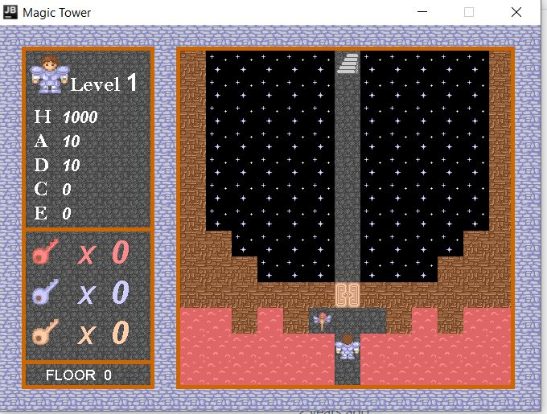
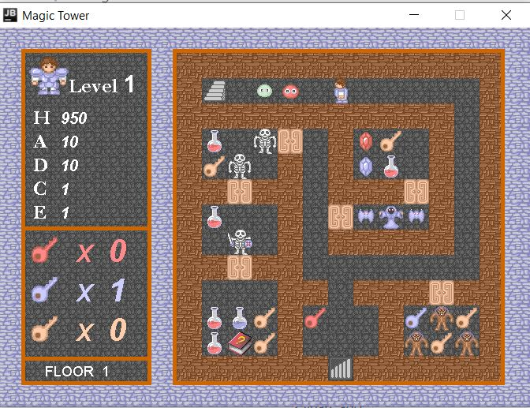
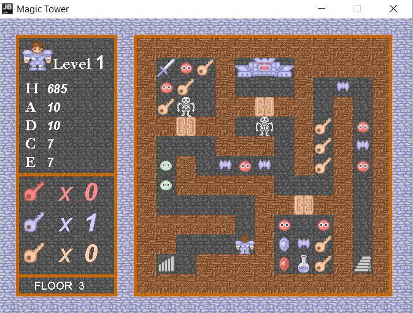

# Magic Tower

## Introduction

The goal of player is to eliminate devils and fight with the king of devils on the twenty-first floor. Player can collect potions and tools on the passages or purchase them in the shops. Player can also interact with NPC to accept various tasks. 

The game contains a 21 floors with lots of characters. Even though you are smart enough, it will also take a few hours to defeat all the monsters. 

---

## Demo

**The Initial Screen**

**Floor 0**

**Floor 1**

**Floor 3**

There are a total of 21 floors with more than 50 types of monsters.

---
## Issues

One of the legacy issue is that all resources are not in the an asset
directory but are maintained under the bin directory. Thus it is dangerous
to delete or overwrite the contents under bin directory as it might erase
all assets. 

Another legacy issue is that the splash screen is incomplete due to lack of
resource and the screen after the gameplay finishes should be added as well.

This game might be refactored entirely in the future with a better design. It
is appealing to add another complete set of features in this RPG game. 
